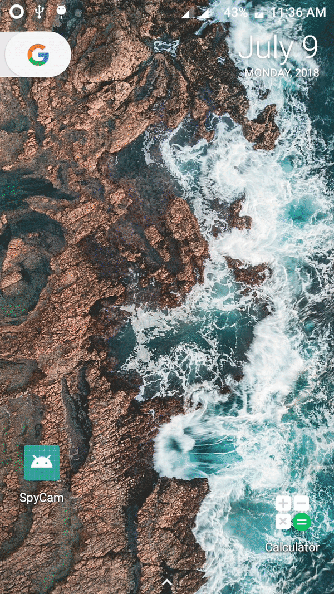

# SpyCam


<a href="https://www.paypal.me/InnocentCoder"></a>


<a href="https://developer.android.com/"></a>

## What is this library for?
This library allows application to take the picture using the device camera without showing the preview of it. Any application can capture the image from front camera in the background.

## Demo

</img>
## Gradle Dependency:
```
allprojects {
		repositories {
			...
			maven { url 'https://jitpack.io' }
		}
	}
}
```
```
dependencies {
    implementation 'com.github.Rj-Innocent-Coder:SpyCam:1.0'
}
```
## How to integrate?

Step-1 : Create Instance of SpyService 

       private SpyService spyService;
Step-2 : Initialize Instance 

     spyService = SpyServiceImp.getInstance(this,"Spy");
 in This you have to pass to parameter first is Activity and other is the name of directory that will be create by librery in sdcard with image captured and also it will store image name is ```System.currentTimeMillis(); ```
 
 Step-3 : Implement ```SpyListener``` and override method.
 
    @Override
    public void onCaptureDone(String s, byte[] bytes) {
        Toast.makeText(this, "Captured", Toast.LENGTH_SHORT).show();   
    }

    @Override
    public void onDoneCapturingAllPhotos(TreeMap<String, byte[]> treeMap) {

    }
Here in onCaptureDone you will be receive an byte array of image from which you can create bitmap and set it to imageview.
     
 Step-4 : call startCapturingMethod to start taking picture
 
      spyService.startCapturing(this); 
     
Step-5 : Add Permission in Manifest

     <uses-permission android:name="android.permission.CAMERA"/>
    
     <uses-permission android:name="android.permission.WRITE_EXTERNAL_STORAGE"/>

### Congratulations You have successfully applied SpyCamera Feature in you app 

## License
